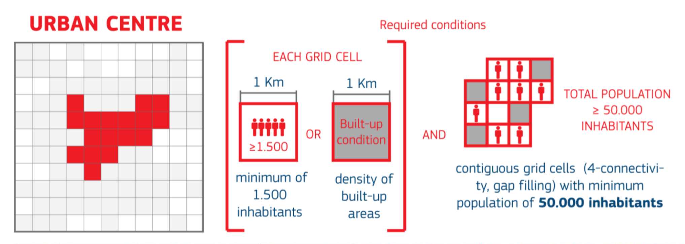

# Main objective
Creates geographic matching tables between Oxford Economics eFUA, GHS-FUA and GHS Urban Centres.

# Definitions 
Each dataset has a different urban definition, as such:

- OE eFUA: Overlay municipality and OECD’s definition of eFUA boundaries to include local units which have at least half of its population living within the eFUA boundary.
- GHS-FUA: Areas in which at least 15% of the population is commuting to the main Urban Centre of the area. Delineated commuting area of the Urban Centres of epoch 2015, estimated through an automated classification procedure developed using OECD defintion/methodology.
- GHS-UC: Areas defined by specific cut-off values on resident population and built-up surface share in a 1x1 km uniform global grid. 

# Tasks
1. Review defintions and temporal dimension
2. Create code for uploading and generate unique matching code
3. Create matching table

# Technical documentation
- GHS-UCDB R2019A:[Description of the GHS Urban Centre Database 2015](https://op.europa.eu/en/publication-detail/-/publication/aec4581b-29c5-11e9-8d04-01aa75ed71a1/language-en)
- GHS-FUAs: [GHSL-OECD Functional Urban Areas](https://human-settlement.emergency.copernicus.eu/documents/GHSL_FUA_2019.pdf?t=1583246033)
- eFUA methodology:[OECD’s approach to developing eFUAs](https://www.oecd.org/en/publications/cities-in-the-world_d0efcbda-en.html)
- OE: proprietary data

# Geographic Matching and Variable Documentation

## 1. Geographic Matching
# Geographic Matching and Variable Documentation
### eFUA Dataset Aggregation (2000-2015)

#### Geographic Matching Process
- **Step 1**: eFUAs contain multiple Urban Centres (UCs) linked by semicolon-delimited IDs
- **Step 2**: Each UC spatially joined to corresponding eFUA geometry
- **Step 3**: Main UC identified as center with highest population (P15)

#### Variable Aggregation Rules

| Operation Type | Variables | Method |
|----------------|-----------|---------|
| **Simple Sum** | Built-up area (B00, B15), Population (P00, P15), GDP totals, All emissions categories, Flood/sea level exposure | Direct summation across all UCs within eFUA |
| **Population Weighted Sum** | Built-up per capita (BUCAP15), GDP per capita | `sum(value × population) / sum(population)` |
| **Area Weighted Sum** | Night lights (NTL_AV), Green areas, PM2.5 concentrations | `sum(value × area) / sum(built-up area)` |
| **Value of Main UC** | Travel time to center (TT2CC), SDG indicators | Value taken from UC with highest population |

#### Post-Aggregation Calculations
- **Growth Rates**: Compound Annual Growth Rate using `(final/initial)^(1/years) - 1`
- **Percentage Changes**: `(final - initial) / initial × 100`
- **Per Capita Metrics**: Total values divided by aggregated population

### UCDB-eFUA Matching (2020-2025 data)

#### Geographic Intersection Method
1. **Spatial Intersection**: UC boundaries intersected with eFUA boundaries
2. **Area Calculation**: Intersection area computed for each UC-eFUA pair
3. **Population Distribution**: UC population allocated proportionally by area
4. **Assignment Rule**: UC assigned to eFUA if >50% of population falls within eFUA
5. **Main UC Selection**: Highest population UC designated as main center per eFUA

#### Results Summary
- **Total UCs**: 11,422
- **UCs assigned to eFUA**: 9,554 (83.6%)
- **Main UCs identified**: 7,824
- **Unmatched UCs**: 1,868 (failed 50% rule)

#### Variable Aggregation for UCDB Data

| Operation Type | Variables | Weighting Method |
|----------------|-----------|------------------|
| **Simple Sum** | Population, Built-up surface, GDP, Total events | Direct summation |
| **Population Weighted** | Education indicators, Per capita emissions, Flood exposure shares, Infrastructure indices | `sum(value × population) / sum(population)` |
| **Area Weighted** | Green area share, Hospital access, Road density | `sum(value × built-up area) / sum(built-up area)` |

### Data Quality Controls

#### Distortion Metrics
- **Area Distortion**: `aggregated_UC_area / eFUA_area`
- **Population Distortion**: `aggregated_UC_population / eFUA_population`

#### Validation Checks
- **Multiple Assignment Warning**: Flags UCs assigned to multiple eFUAs
- **Coverage Verification**: Confirms all eFUAs have at least one assigned UC
- **Geometry Consistency**: Validates spatial joins and area calculations

### Key Limitations

1. **Boundary Misalignment**: UC and eFUA boundaries don't perfectly align
2. **Temporal Inconsistency**: Different reference years (2015 vs 2020-2025)
3. **Population Assumptions**: Area-based population distribution may not reflect reality
4. **Missing Data**: 16.4% of UCs couldn't be assigned to eFUAs
5. **Commuting Zone Inclusion**: eFUAs include areas structurally different from UCs

### Methodological Assumptions

- **50% Population Rule**: Reasonable threshold for UC-eFUA assignment
- **Area-Population Proportionality**: Population distributed evenly within UC boundaries
- **Main UC Selection**: Largest population center represents eFUA characteristics
- **Aggregation Validity**: Different weighting schemes appropriate for different variable types

### Country Name Standardization

The following country name mappings ensure consistency across datasets:
- United Arab Emirates → UAE
- Democratic Republic of the Congo → Democratic Republic of Congo
- Republic of the Congo → Congo
- Cabo Verde → Cape Verde
- Czechia → Czech Republic
- Laos → Lao PDR
- México → Mexico
- Swaziland → Eswatini

---

## 2. Variable Definitions

### Urban Change Variables (UCDB Dataset)

| Variable | Definition | Geography | Data Source | Aggregation Method |
|----------|------------|-----------|-------------|-------------------|
| **UC_extent_change** | Change in urban centre extent (30% threshold) 2015-2020 | Urban Centres (GHSL definition) | GHS UCDB 2024 | Spatial analysis of built-up area |
| **Built_up_pc_change** | Change in built-up per capita 2015-2020 | Urban Centres (GHSL definition) | GHS UCDB 2024 | Built-up area / population ratio difference |
| **Built_rel_change** | Relative change in built-up surface 2015-2020 | Urban Centres (GHSL definition) | GHS UCDB 2024 | Proportional change in built surface |

### Economic Structure Variables (OECD Dataset)

#### Employment Indicators

| Variable | Definition | Geography | Data Source | Aggregation Method |
|----------|------------|-----------|-------------|-------------------|
| **Public_Services_Emp_Pct** | Employment in public services as % of total employment | Metropolitan areas/Cities (OECD definition) | OE Database | EMPO_Q / EMPTOTT |
| **Industry_Emp_Pct** | Employment in industry as % of total employment | Metropolitan areas/Cities (OECD definition) | OE Database | EMPB_F / EMPTOTT |
| **Financial_Business_Services_Emp_Pct** | Employment in financial & business services as % of total | Metropolitan areas/Cities (OECD definition) | OE Database | EMPK_N / EMPTOTT |
| **Consumer_Services_Emp_Pct** | Employment in consumer services as % of total employment | Metropolitan areas/Cities (OECD definition) | OE Database | EMPGIR_U / EMPTOTT |
| **Agriculture_Emp_Pct** | Employment in agriculture as % of total employment | Metropolitan areas/Cities (OECD definition) | OE Database | EMPA / EMPTOTT |
| **Transport_Information_Communic_Services_Emp_Pct** | Employment in transport, information & communication as % of total | Metropolitan areas/Cities (OECD definition) | OE Database | EMPHJ / EMPTOTT |

#### Gross Value Added (GVA) Indicators

| Variable | Definition | Geography | Data Source | Aggregation Method |
|----------|------------|-----------|-------------|-------------------|
| **Agriculture_GVA_Pct** | Agricultural GVA as % of total GVA (PPP adjusted) | Metropolitan areas/Cities (OECD definition) | OE Database | GVAAPPPC / GVATOTPPPC |
| **Consumer_Services_GVA_Pct** | Consumer services GVA as % of total GVA (PPP adjusted) | Metropolitan areas/Cities (OECD definition) | OE Database | GVAGIR_UPPPC / GVATOTPPPC |
| **Financial_Business_Services_GVA_Pct** | Financial & business services GVA as % of total GVA (PPP adjusted) | Metropolitan areas/Cities (OECD definition) | OE Database | GVAK_NPPPC / GVATOTPPPC |
| **Industry_GVA_Pct** | Industrial GVA as % of total GVA (PPP adjusted) | Metropolitan areas/Cities (OECD definition) | OE Database | GVAB_FPPPC / GVATOTPPPC |
| **Public_Services_GVA_Pct** | Public services GVA as % of total GVA (PPP adjusted) | Metropolitan areas/Cities (OECD definition) | OE Database | GVAO_QPPPC / GVATOTPPPC |
| **Transport_Information_Communic_Services_GVA_Pct** | Transport, information & communication GVA as % of total GVA (PPP adjusted) | Metropolitan areas/Cities (OECD definition) | OE Database | GVAHJPPPC / GVATOTPPPC |

#### Economic Indicators

| Variable | Definition | Geography | Data Source | Aggregation Method |
|----------|------------|-----------|-------------|-------------------|
| **GDP_per_capita_PPP** | GDP per capita adjusted for purchasing power parity | Metropolitan areas/Cities (OECD definition) | OE Database | GDPTOTPPPC / POPTOTT |

### Data Processing Notes

- **Time Coverage**: OECD data covers 2001-2021, UCDB data covers 2015-2020 changes.
- **Missing Values**: All rows with missing key variables are filtered out.
- **PPP Adjustment**: All GVA and GDP variables are purchasing power parity adjusted.
- **Percentage Calculations**: Employment and GVA percentages calculated as sector value divided by total.
- **Geographic Filtering**: Only locations where Country ≠ Location are included (excludes country-level aggregates).

---

## 3. Data Aggregation Problems and Limitations

### Geographic Matching Issues

Several critical issues impact the reliability and comparability of results across different urban definitions:

#### **Population Reference Year Inconsistencies**
- **Issue**: All datasets currently use 2020 population for clipping OE and UC data.
- **Impact**: Creates temporal misalignment for historical analysis.
- **Recommendation**: Use population data corresponding to each analysis year.

#### **Growth Variable Calculations**
- **Issue**: No eFUA-level population data available for 2000.
- **Current Solution**: Growth variables based on UC data measuring 2000-2015 changes.
- **Impact**: Mixed geographic definitions in growth calculations affect comparability.

#### **eFUA-UC Compatibility Problems**
- **Issue**: eFUA boundaries not compatible with 2024 UC data.
- **Current Solution**: Geographic matching using 50% overlap rule.
- **Impact**: Some variables measured for 2024/2025 while others use 2020 baseline.
- **Result**: Temporal and spatial comparability issues.

### Dataset-Specific Limitations

#### **Time Range Constraints**

| Dataset | Available Time Range | Limitation |
|---------|---------------------|------------|
| **eFUA** | 2000-2015 changes only | Limited to historical analysis |
| **UCDB** | 2000-2020 (5-year increments) | More comprehensive temporal coverage |
| **OE** | 2005-2021 annual data | Best temporal resolution |

#### **Data Point Scarcity Issues**

The following visualizations are affected by insufficient data points:

| Graph Type | Time Range | Database | Data Points Available | Impact |
|------------|------------|----------|----------------------|--------|
| **Night lights growth comparison** | 2015 | eFUA | 1 data point | Cannot show trend |
| **Built-up area growth** | 1975-2015 | eFUA | Max 3 points (75-90; 90-20; 20-15) | Limited trend analysis |
| **GDP growth (UCDB)** | 2000-2015 | UCDB | 4 data points | Sparse temporal coverage |
| **GVA structure timeseries** | 2000-2015 | UCDB | 4 data points | Limited trend analysis |
| **GHG emissions per capita** | 2000-2015 | UCDB | 4 data points | Insufficient for trend analysis |
| **Flood exposure analysis** | 2000-2015 | UCDB | 4 data points | Static rather than temporal view |

### Implications for Analysis

#### **Comparability Concerns**
- **Cross-database comparisons** may be misleading due to different geographic definitions.
- **Temporal analysis** limited by inconsistent time ranges and sparse data points.

